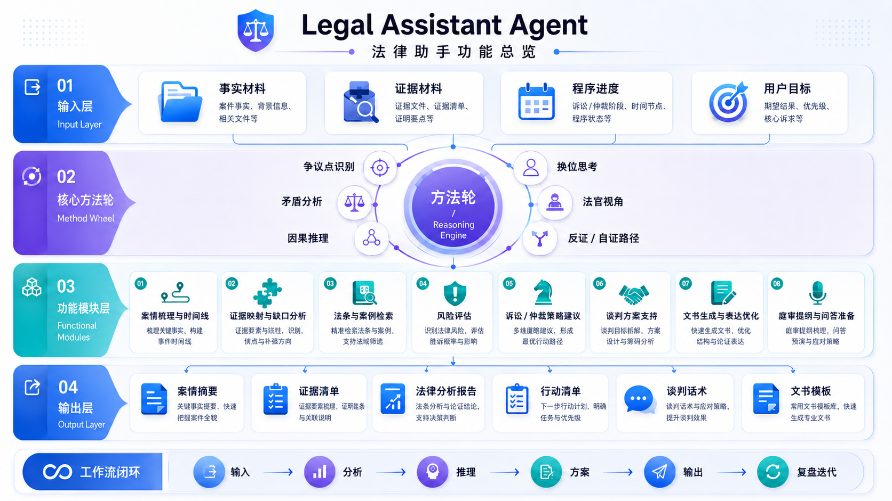

# 法律助手智能体 Legal-Assistant_agent


> 一个面向法律事项分析、合同工作、法律研究、策略推演和专业交付的 AI 法律工作台。

**作者：Kevin KE / [laoke.ai](https://laoke.ai)**



> 功能总览图使用虚构信息，仅展示输入层、方法轮、功能模块、输出层和工作流闭环，不包含真实案件信息。The overview uses fictional information only.

---

## 中文

### 项目简介

**法律助手智能体 Legal-Assistant_agent** 是一套面向真实法律工作的 AI 法律工作台。它以 `AGENTS.md` 为入口，让 AI 助手在处理法律事项时不只是即时回答，而是按法律工作者的方式持续推进：识别事项类型、法域和目标，整理事实、证据、争点、来源、风险和行动路径，并形成可复盘、可更新、可交付的分析成果。

它适用于法律纠纷分析、合同审查、合同起草、法律研究、谈判准备、文书草拟和阶段性复盘。复杂案件会先形成面向法律工作者的案件驾驶舱和面向用户的咨询纪要，再根据材料成熟度沉淀证据台账、争点分析、案件包、文书框架、庭审准备和专业报告。默认回答会先在对话中给出结构化汇总结论；如需正式交付，可继续要求导出 Markdown 或样式化 PDF 报告。

> 本项目不替代律师，不承诺案件结果。涉及诉讼时效、程序期限、关键证据、最新法规或高风险行动时，应核验官方/权威来源，并在必要时咨询相关法域的合格律师。

### 工作方式

```text
用户输入法律事项
→ 识别语言、法域、事项类型和用户目标
→ 创建或复用本地事项文件夹
→ 生成案件驾驶舱和咨询纪要
→ 整理事实、证据、争点、来源和风险
→ 按需要生成案件包、文书框架或庭审手册
→ 输出分析结论、行动建议和必要文书
→ 在对话中汇总结论，按需生成专业报告 Markdown / 样式化 PDF
→ 后续新证据或新进展继续更新同一事项
```

复杂事项会在本地工作目录中生成独立事项文件夹，用于保存阶段记录、分析底稿、参考来源、行动建议和按需生成的交付报告。

### 主要产物

常见输出包括：

- `plan.md`：事项阶段、下一步、责任方、待补信息和执行记录。
- `case.md`：案件或事项的关键事实、争点、程序状态和核心记忆。
- `case_dashboard.md`：一页式案件驾驶舱，呈现案件主线、胜败关键、争点树、证明责任和可信度。
- `consultation_note.md`：面向用户或客户的咨询纪要，说明当前判断、限制、风险和补充材料。
- `analysis.md`：完整法律分析底稿。
- `advice.md`：面向用户的策略、行动建议和表达风险。
- `sources.md`：法律、案例、政策、网页等来源及核验状态。
- `<主题>专业报告.md`：用户要求正式报告文件时生成的法律分析报告。
- `<主题>专业报告.pdf`：用户明确要求 PDF 时生成；与 Markdown 报告一致，并经过版式渲染和可读性检查。

成熟案件还可以继续生成 `case_package.md`、`pleading_framework.md`、`hearing_playbook.md` 和 `review_delta.md`，用于内部案件包、文书准备、开庭/听证准备和新材料复盘。

### 报告导出

默认分析不自动生成 PDF，避免每次咨询都产出不必要的文件。当你需要正式归档、发送给律师或用于内部讨论时，可以要求生成 Markdown 报告或样式化 PDF。

PDF 样式和渲染工具在项目根目录统一管理，不需要复制到每个事项文件夹：

- `assets/legal-report.css`：Legal-Assistant_agent 的专业报告视觉系统。
- `tools/render_report_pdf.py`：可选 PDF-native 渲染器，默认“输入目录 = 输出目录”。

示例：

```sh
python tools/render_report_pdf.py "work/<date>_<事项名>"
```

该命令会自动查找事项目录下的专业报告 Markdown，并在同一目录生成同名 PDF。

### 使用方式

推荐使用方式：

```text
请参考这个 https://github.com/KevinKE93/Legal-Assistant_agent ，帮我分析下面这个法律事项/合同/问题……
```

临时调用：

```text
请按照 Legal-Assistant_agent 的工作流分析下面这个法律事项，并先给出结构化汇总结论。如果我需要正式 PDF 报告，会另行提出。
```

全局或 `/` 指令调用：

```text
/legal-assistant 分析这个法律事项……
```

如果你的 AI 客户端支持自定义命令，可以将命令配置为“读取并遵循本仓库的 `AGENTS.md`”。本仓库不提供安装脚本，适合通过提示词、项目规则或自定义命令直接接入。

### 适用场景

- 劳动争议、合同纠纷、消费纠纷、租赁纠纷等复杂事项分析。
- 合同、补充协议、和解协议、服务协议等文本审查。
- 合同草案、沟通函、投诉材料、仲裁/诉讼框架和庭审提纲准备。
- 法律规则、案例、政策和官方网页的检索记录与引用风险整理。
- 新证据、新报价、新程序节点出现后的持续复盘。

### 安全边界

Legal-Assistant_agent 不会：

- 替代律师或承诺案件结果。
- 编造法条、案例、案号、法院、证据或裁判观点。
- 指导伪造、篡改、隐藏、销毁或歪曲证据。
- 指导虚假陈述、诱导他人作虚假陈述或非法取证。
- 指导骚扰、威胁、盗号、定位、跟踪或公开隐私。
- 在未审查证据的情况下，把用户单方陈述当作已证明事实。

---

## English

### Overview

**Legal-Assistant_agent** is an AI legal workbench for legal matter analysis, contract work, legal research, strategy planning, drafting, negotiation preparation, and professional delivery. It uses `AGENTS.md` as the main entrypoint and guides an AI assistant to work like a structured legal matter workspace rather than a one-off Q&A assistant.

For complex matters, the agent creates or reuses a local matter folder, first builds a case dashboard and consultation note, then records facts and evidence, maps issue trees and proof burdens, tracks source verification, explains legal-rule applicability boundaries, prepares strategy or draft documents, and gives a structured briefing in the conversation by default. A professional Markdown report or styled PDF can be generated when the user explicitly asks for a formal deliverable.

This project is not a substitute for licensed legal counsel and does not promise outcomes. Deadlines, limitation periods, procedural rules, current law, key evidence, and high-stakes actions should be verified against authoritative sources and reviewed by qualified counsel in the relevant jurisdiction.

### How It Works

```text
User provides a legal matter
→ Identify language, jurisdiction, matter type, and user goal
→ Create or reuse a local matter folder
→ Produce a case dashboard and consultation note
→ Organize facts, evidence, issues, sources, and risks
→ Prepare a case package, pleading framework, or hearing playbook when needed
→ Produce analysis, guidance, and draft documents when needed
→ Summarize conclusions in chat, then generate a professional Markdown / styled PDF report on request
→ Continue updating the same matter when new information appears
```

For complex matters, the agent keeps a dedicated local matter folder for stage notes, working analysis, source records, action guidance, and on-request deliverables.

### Deliverables

- `plan.md`: stage plan, next actions, owner, missing information, and execution notes.
- `case.md`: matter memory, key facts, issues, procedural status, and conclusions.
- `case_dashboard.md`: one-page case map for legal workers.
- `consultation_note.md`: user-facing consultation summary, limits, risks, and material requests.
- `analysis.md`: working legal analysis.
- `advice.md`: user-facing strategy and action guidance.
- `sources.md`: statutes, cases, policies, URLs, verification status, and citation risks.
- `<topic> Professional Report.md`: final or stage-based professional report when the user requests a file deliverable.
- `<topic> Professional Report.pdf`: rendered PDF version when the user explicitly requests PDF and the environment can generate a readable, styled PDF.

### Report Export

PDF is not generated by default for ordinary analysis. When you need a formal deliverable for archiving, lawyer review, or internal discussion, ask for a Markdown report or styled PDF.

PDF rendering assets are managed at the project root and are not copied into each matter folder:

- `assets/legal-report.css`: the canonical legal report visual system.
- `tools/render_report_pdf.py`: an optional PDF-native renderer; by default, the input directory is also the output directory.

Example:

```sh
python tools/render_report_pdf.py "work/<date>_<matter>"
```

The command auto-detects the professional report Markdown and writes the PDF next to it.

### Usage

Recommended use:

```text
Paste https://github.com/KevinKE93/Legal-Assistant_agent into your AI chat and say:
"Please refer to this Legal-Assistant_agent workflow and help me analyze the following legal matter, contract, or question..."
```

Temporary invocation:

```text
Use Legal-Assistant_agent to analyze this legal matter and first provide a structured conclusion briefing. If I need a formal PDF report, I will ask for it separately.
```

Slash-command style:

```text
/legal-assistant analyze this matter...
```

If your AI client supports custom commands, configure the command to read and follow this repository's `AGENTS.md`. This repository does not ship an installer; it is designed to be used through prompts, project rules, or custom commands.

## Author

**Kevin KE**  
**laoke.ai**  
Website: [https://laoke.ai](https://laoke.ai)

## License

MIT License. See `LICENSE` for details.
